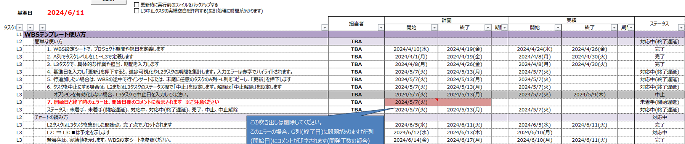

# Simple-Excel-WBS

> MS Projectは少し大げさ。Excelだけで、予定・実績・遅延を見える化。

Simple-Excel-WBSは、Microsoft Excelで使えるマクロ付きのWBSテンプレートです。タスクをL1〜L3の階層で整理し、計画と実績を入力して「更新」を押すだけで、進捗を見える形に整えます。

## こんなときに

- 小〜中規模のプロジェクトをExcelで手軽に管理したい
- 専用のプロジェクト管理ツールを導入するほどではない
- 計画日と実績日を並べて、遅延を見つけやすくしたい
- チームへそのまま渡せるWBSのひな形がほしい

## 主な機能

- L1〜L3のタスク階層
- 計画日・実績日・担当者・ステータスの管理
- 「更新」ボタンによる進捗の可視化とL2タスクの期間集計
- 開始日・終了日の入力エラーや遅延の表示
- 休日、プロジェクト期間、表示色などの設定
- 中止タスクと中止解除への対応
- ブック内に使い方を収録

## 使い方

1. [開発WBSテンプレート.xlsm](開発WBSテンプレート.xlsm)をダウンロードします。
2. Windows版のデスクトップExcelで開き、マクロを有効にします。
3. `WBS設定`シートで、プロジェクト期間や休日を設定します。
4. `スケジュール`シートでL1〜L3のタスク、担当者、計画日、実績日、ステータスを入力します。
5. シート上部の「更新」を押します。

詳しい操作方法は、テンプレートを開いたときに表示される「WBSテンプレート使い方」に記載しています。

## 動作環境

- VBAマクロを利用できるMicrosoft Excel
- Windows版のデスクトップExcelを推奨

Excel OnlineではVBAマクロを実行できません。

## ご利用上の注意

- 初めて使うときは、元ファイルのバックアップを残してください。
- ダウンロードしたファイルのマクロがブロックされる場合は、Windowsのファイルのプロパティで「許可する」を選ぶか、Excelの信頼できる場所へ保存してください。
- 実運用へ導入する前に、ご自身の環境とデータで動作を確認してください。

## フィードバック・サポート

不具合、改善案、詳しいマニュアルのご要望は、[Issues](https://github.com/takamichikojima/Simple-Excel-WBS/issues)からお知らせください。

このツールが役に立ったら、[GitHub Sponsors](https://github.com/sponsors/takamichikojima)から応援していただけるとうれしいです。

## ライセンス

[MIT License](LICENSE)
